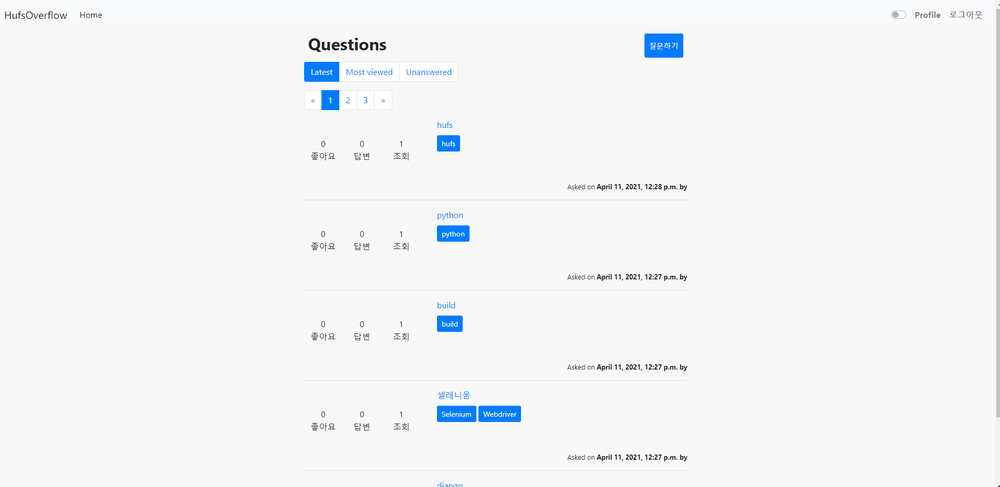
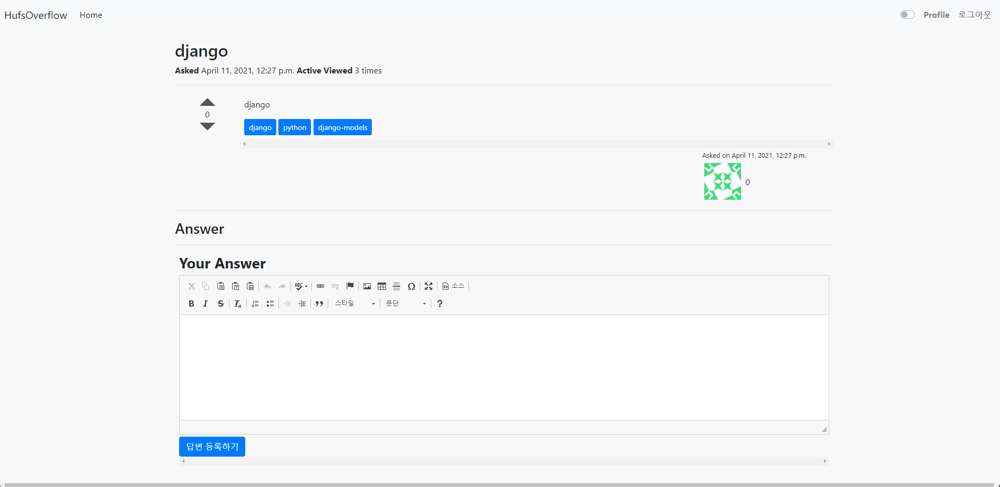
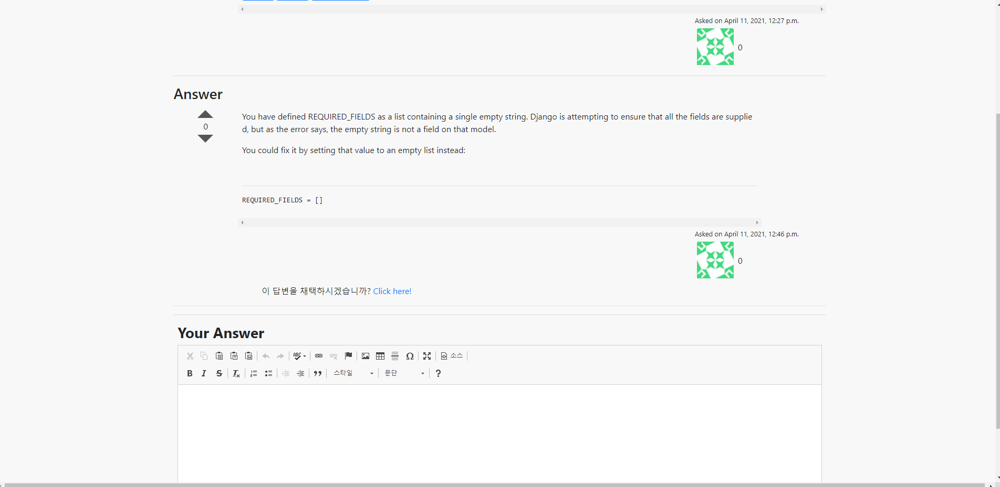
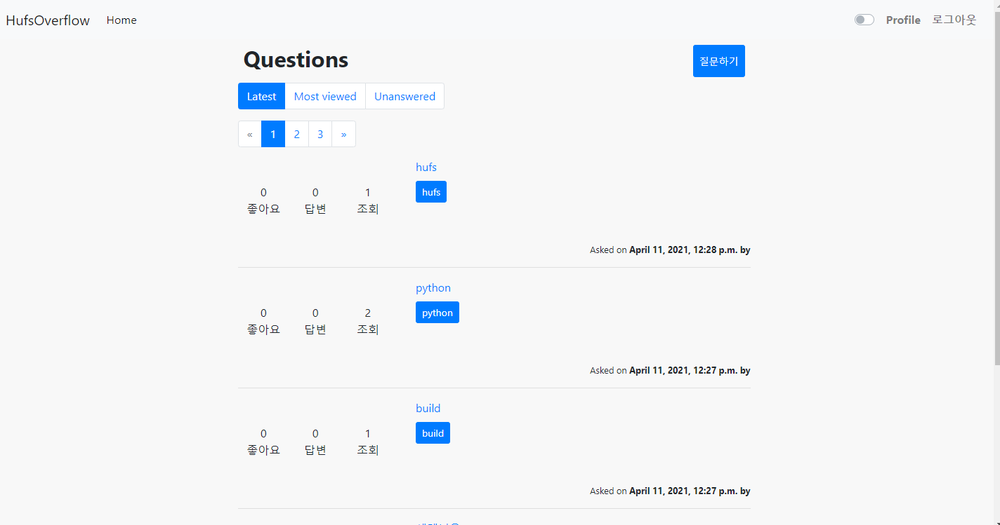
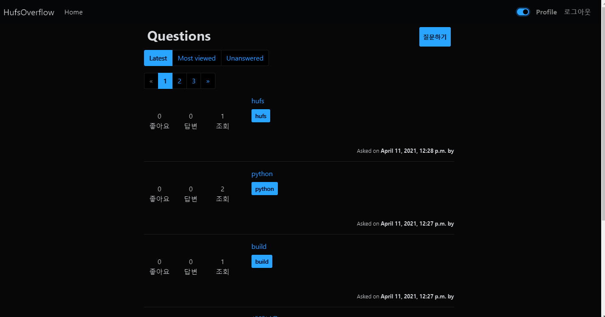
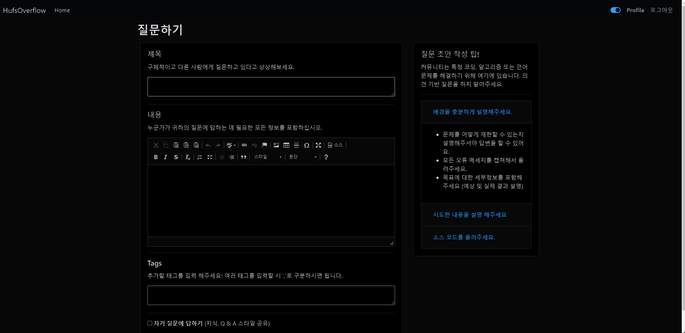
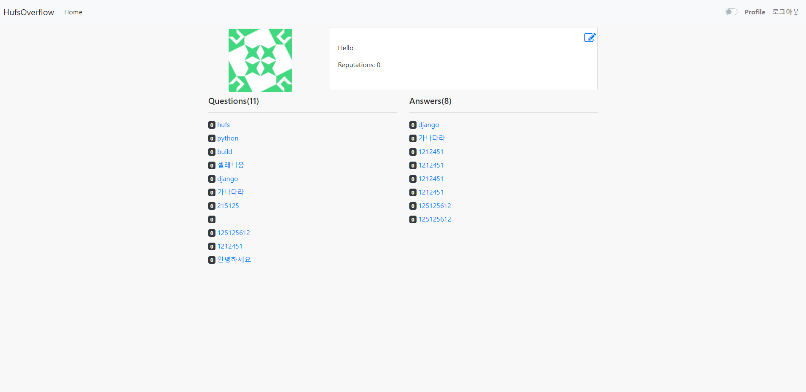
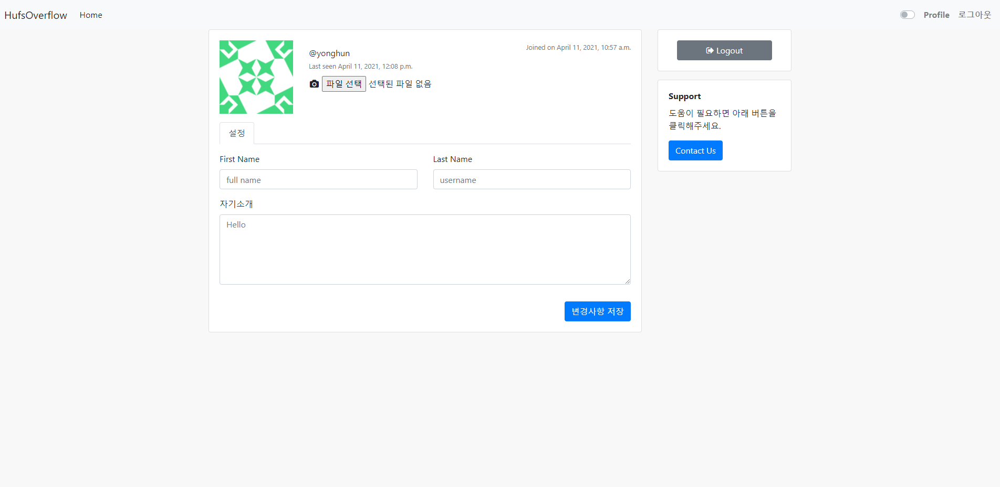

<p align="center">

</p>

<h1 align = 'center'> HUFSOverflow
</h1>

&emsp;&emsp;&emsp;&emsp;&emsp;&emsp;[](https://www.djangoproject.com/)
&emsp;
[](https://www.postgresql.org/)
&emsp;
[](https://www.jetbrains.com/ko-kr/pycharm/features/ "Pycharm")


<h2 align='center'> About </h2>
<p align='center'>
이 프로젝트는 <a href="http://stackoverflow.com/">Stackoverflow</a> 기반이며, 한국외국어대학교 교내 코딩 질문 게시판 목적으로 구현되었습니다.
   <br><br>
   <b>For developers, by developers</b>
   <br><br>
HUFSOverflow는 코딩하는 한국외국어대학교 학생을 위한 커뮤니티입니다. 가장 까다로운 코딩 질문에 대한 답변을 얻고, 동료들과 개인적으로 지식을 공유할 수 있도록 도와드립니다.</p>

-----------------------------------

### Preview



-----------------------------------

### Question-Accepted answer


<br><br>


-----------------------------------

### LightMode-Darkmode


<br><br>


-----------------------------------

### Ask Question



-----------------------------------

### Profile-Edit Profile


<br><br>


-----------------------------------

### 🚀 Features

<p align="left">
   <ul>
      <li>질문하기</li>
      <li>답변하기</li>
      <li>공감 / 비공감</li>
      <li>프로필</li>
      <li>다크모드</li>
      <li>사용자 평판</li>
      <li>✅ 완료된 질문</li>
      <li>필터 - 태그, 제목, 조회수, 답변 / 미답변, 최신</li>
   </ul>


-----------------------------------

### 💻 Tech stack

`Backend` : Django <br>
`Database` : PostgreSQL <br>
`Frontend` : CSS, HTML, Bootstrap, jQuery  <br>

-----------------------------------

### 🚀 설치 가이드

개발 환경을 실행하는 방법을 설명하는 단계별 예제 시리즈

In your cmd:

```
git clone https://github.com/RugvedB/Stackoverflow-Clone
```

Then,

```
cd Stackoverflow-Clone
pip install -r requirements.txt
python manage.py makemigrations
python manage.py migrate
```

Next

Create a .env file, enter your credentials for following fields

```
EMAIL_HOST = ENTER YOUR EMAIL HOST
EMAIL_PORT = ENTER YOUR EMAIL PORT
EMAIL_HOST_USER = ENTER YOUR EMAIL ID
DEFAULT_FROM_EMAIL = ENTER YOUR EMAIL ID
EMAIL_HOST_PASSWORD = ENTER YOUR EMAIL PASSWORD
SECRET_KEY = ENTER YOUR SECRET_KEY
```

or 암호키 직접 입력

Then

```
python manage.py runserver
```

You are done with the setup now!

------------------------------------------

### 📝 To-do List

- [ ] 공지사항
- [ ] 비밀번호 찾기 기능
- [ ] 이메일 인증
- [ ] 소셜로그인
- [ ] 대댓글 기능
- [ ] 검색 기능
- [ ] 에디터 커스텀

------------------------------------------
